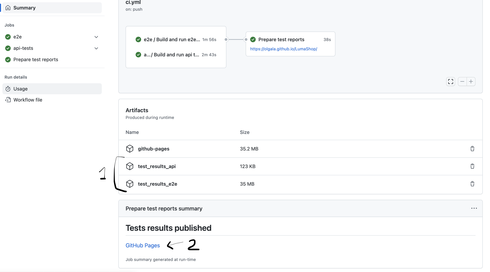

# LumaShop

This repository contains two projects: 

* [luma-shop-e2e](/luma-shop-e2e) contains Playswirte tests for web application.
* [starwars-api-tests](/starwars-api-tests/) contains JUnit tests for REST API

## Tests results

There is a GitHub Actions pipeline that runs tests from both projects and publishes test reports to GitHub Pages.

1. Zip files with test results (deleted after 45 days of renention period)
2. URL to GitHub Pages site with results. (will be overwritten by subsequent runs, no retention).