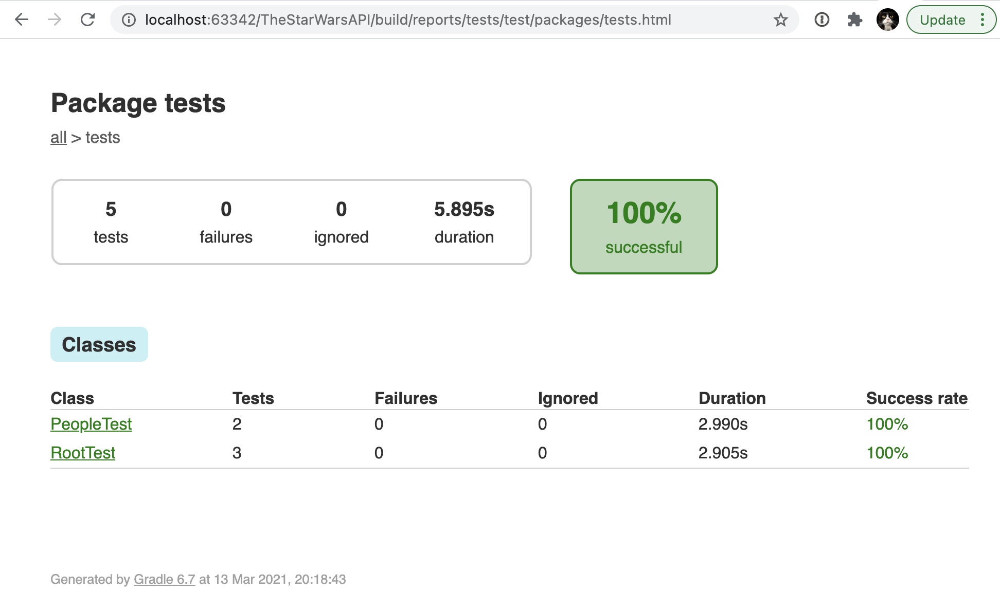

# star-wars-api-tests

The project contains API tests for https://swapi.dev/

## How to run tests with gradle

1. [Install gradle](https://gradle.org/install/) and the latest java
2. Clone the project
3. Go to the project folder
4. Run the command in terminal:

`gradle test` or `./gradlew test` (for Windows: `gradlew test`)

## How to run tests in Docker:

If you don't have Gradle and/or latest JDK installed on your machine you can run tests in Docker.

1. [Install Docker](https://docs.docker.com/get-docker/) on your local machine 
2. Clone the project 
3. Go to the project folder
4. Run the command in terminal:

Linux/Mac

```bash
docker compose --file tools/docker/docker-compose.api.yml up && docker compose  --file tools/docker/docker-compose.api.yml rm
```

If you are going to run the tests on Windows machine, please change `${PWD}` in `docker-compose.api.yml` to the absolute path to the project folder.

## View the test report

Open `index.html` in a browser to see the tests results. This file will be generated in `test-results-api/` directory.

You should see the following results:



**NOTE:** One of the tests is failing. This is expected because of this [issue](https://github.com/Juriy/swapi/issues/50).


## View the test report produced by CI 

This repository contains a GitHub Actions build pipeline that can be triggered by on every push to main branch, pull request or manualy. It executes `gradle test` command in a docker container, and then uploads test reports as build artifacts. 

You can find and download them by navigating to https://github.com/OlgaLa/LumaShop/actions and selecting the latest run log. The artifacts would be located in **Artifacts** section at the bottom of the page. 

**Note** artifacts renention period is set to 45 days, they are deleted after this period.

